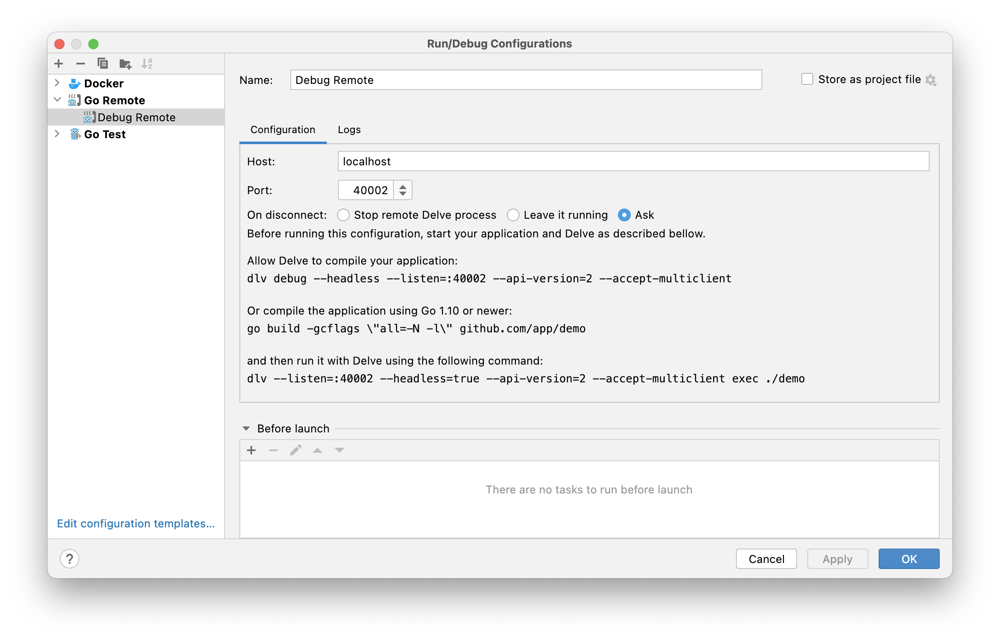

# Subscriptions Service

### Local Setup

##### First Time?

```
  brew install tilt
  brew install k3d
  brew install istioctl
  brew install jq
  brew install helm
  go install github.com/deepmap/oapi-codegen/cmd/oapi-codegen@v1.11.0
  
  make setup-k3d
```

 - Go to https://github.com/settings/tokens.
 - Click "Generate new token"
 - Name it "Container Registry", select read:packages from the list, click "Generate Token"
 - Copy the key from the next page

```
echo "github-username:the-token" | base64
```

Copy the output

```
echo '{"auths":{"ghcr.io":{"auth":"paste-output-here"}}}' | base64
```

Create a file named imagepull.yaml in your home directory:

```
kind: Secret
type: kubernetes.io/dockerconfigjson
apiVersion: v1
metadata:
  name: dockerconfigjson-github-com
  labels:
    app: app-name
data:
  .dockerconfigjson: output-of-last-command-here
```

Now add the secret to your k3d cluster, start it if it's not already running (see below) then run

```
kubectl apply -f imagepull.yaml
```

Go back to https://github.com/settings/tokens, click on the "Configure SSO" dropdown and click "Authorize" next to KL-Engineering.

##### To run locally in K3d:

```
  make run-k3d
```

##### To remote debug locally 

- Add the following configuration in Goland (TODO also add instructions for VScode)


##### To run unit tests

```
  make test-unit
```

##### To run integration tests

```
  make test-integration
```

### Profiles

Add `-profile=profile-name` to the command line or `PROFILE=profile-name` as an environment variable to select a profile when running.  The config is then loaded from the relevant json file in the profiles directory.

Values can be overriden by environment variables by using an underscore to traverse the JSON structure, e.g. `SERVER_PORT=1234` will override the Server.Port config value.

### Open API

Endpoint boilerplate is generated from openapi-spec.yaml.

```
make openapi-generate
```

This generates src/api/api.gen.go.  This contains an interface which you need to implement in api_impl.go.

There are two extensions to the openapi format:
 - x-auth-api-key - this takes a permission name as the value
 - x-auth-jwt - this takes true as the value

If one or both of these are set on an endpoint, auth will be enforced on that endpoint.

JWT tokens are passed in the Authorization header, we don't validate these in the app (as that is the responsibility of a gateway plugin) 
so during development you can provide an arbitrary JWT.  You can generate one with the following Javascript:

```
const header = '{"alg": "HS256","typ": "JWT"}'

const body = '{"sub": "sub-blabla","name": "Somebody","iat": 123456,"subscription_id": "a9de93fc-2d13-44dd-9272-da7f8c17d155","android_id": "07ff00e4-c1a5-4683-9fcb-613a734d8d3f"}'

console.info(btoa(header).replace("=", "") + "." + btoa(body).replace("=", "") + "." + btoa("invalid signature").replace("=", ""))
```

Api Keys are passed in the X-Api-Key header, we do validate these.  When running locally an API key of 'apikey123' is added automatically.
