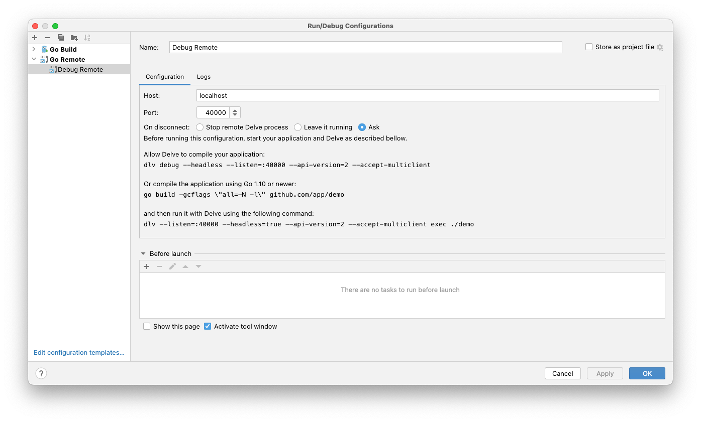

# Subscriptions Service

### Local Setup

##### First Time?

```
  brew install tilt
  brew install k3d
  brew install kubectx 
  brew install istioctl
  brew install jq
  brew install helm
  
  mkdir -p /tmp/k3dvol/  
  k3d cluster create factory --image rancher/k3s:v1.20.15-k3s1 --volume /tmp/k3dvol:/tmp/k3dvol --registry-create local-factory-registry -p "30001:30001@loadbalancer"
  kubectl create ns subscriptions
  kubens subscriptions
  kubectl label namespace subscriptions istio-injection=enabled
  
```

 - Go to https://github.com/settings/tokens.
 - Click "Generate new token"
 - Name it "Container Registry", select read:packages from the list, click "Generate Token"
 - Copy the key from the next page

```
echo "github-username:the-token" | base64
```

Copy the output

```
echo '{"auths":{"ghcr.io":{"auth":"paste-output-here"}}}' | base64
```

Create a file named imagepull.yaml in your home directory:

```
kind: Secret
type: kubernetes.io/dockerconfigjson
apiVersion: v1
metadata:
  name: dockerconfigjson-github-com
  labels:
    app: app-name
data:
  .dockerconfigjson: output-of-last-command-here
```

Now add the secret to your k3d cluster, start it if it's not already running (see below) then run

```
kubectl apply -f imagepull.yaml
```

Go back to https://github.com/settings/tokens, click on the "Configure SSO" dropdown and click "Authorize" next to KL-Engineering.

##### To run locally in K3d:

```
  ./run.sh
```

##### To run locally in docker

```
  ./run-docker.sh
```

##### To remote debug locally in docker

```
  ./run-docker.sh debug
```
- Then add the following configuration in Goland (TODO also add instructions for VScode)


Or to debug the instance in K3D, connect to port 40002 instead.

##### To run unit tests

```
  go test -v ./test/unit/...
```

##### To run integration tests

```
  ./run-integration-tests.sh
```

##### Profiles

Add `-profile=profile-name` to the command line or `PROFILE=profile-name` as an environment variable to select a profile when running.  The config is then loaded from the relevant json file in the profiles directory.

Values can be overriden by environment variables by using an underscore to traverse the JSON structure, e.g. `SERVER_PORT=1234` will override the Server.Port config value.

##### Localstack

Localstack (https://github.com/localstack/localstack) is used in K3D to provide local versions of some AWS services.  To interact with it:

 - Install the AWS CLI: https://aws.amazon.com/cli/
 - Run `aws configure`, enter:
   ```
   AWS Access Key ID [None]: bla
   AWS Secret Access Key [None]: bla
   Default region name [None]: eu-west-1
   Default output format [None]: json
   ```
 - Add to your HOSTS file
   ```
   127.0.0.1 localhost.localstack.cloud
   ```
 - Include an --endpoint-url argument with your commands, e.g. 
   ```
   aws --endpoint-url https://localhost.localstack.cloud:4566 kinesis list-streams
   ```
